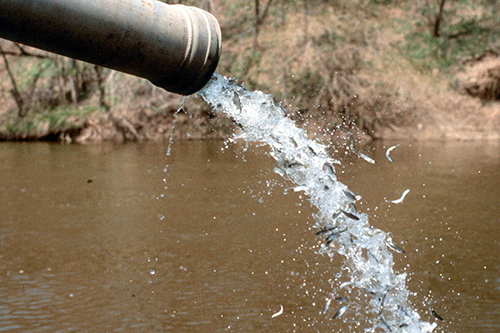

```{r include = FALSE}
knitr::opts_chunk$set(
  eval = FALSE,
  out.width = "80%",
  fig.asp = 0.618,
  fig.width = 10,
  dpi = 300
)
```

```{r photo, fig.margin = TRUE, echo = FALSE, fig.width = 3, fig.cap = "Photo from Great Lakes Fishing Database", eval = TRUE}

```

For Homework-03 you'll continue using the [Great Lakes Database](http://www.glfc.org/great-lakes-databases.php) and [Great Lakes Fish Stocking database](http://www.glfc.org/fishstocking/index.htm).

These databases are updated, maintained, and hosted by the U.S.
Fish and Wildlife Service.

# Learning goals

-   More practice data wrangling and data visualization
-   Practice using join functions to merge data frames
-   Practice using pivot functions to make data frames longer or wider

# Getting started

If you're looking at this RMarkdown document in RStudio, then you've already cloned your Unit 2 repo from Github.
Good job!

As a brief reminder of the steps:

-   Use the Github link to generate your own private versin of the Unit's repo.
-   Name it `unit-X-yourlastname` within the `EAES-420-Spring23` Organization.
-   Copy the URL of the repo you created using the green `Code` button
-   Copy/clone it into a `New Project from a GitHub Repo` in RStudio Cloud.
-   Navigate to the exercise, lab, or homework folder using the `File` pane.
-   Open the R Markdown instructions `lab-X.Rmd` or `hw-X.Rmd` and, Knit.

## Warm up

Before we introduce the data, let's warm up with some simple exercises.

-   Update the YAML, changing the author name to your name, and **knit** the document.
-   Commit your changes with a meaningful commit message.
-   Push your changes to GitHub.
-   Go to your repo on GitHub and confirm that your changes are visible in your Rmd **and** md files. If anything is missing, commit and push again.

## Packages

We'll use the **tidyverse** package for much of the data wrangling {dplyr} and visualisation {ggplot2} functions.
You can load them by running the following in your Console or running the code chunk from within the .Rmd file:

```{r load-packages, message = FALSE, eval = TRUE}
library(tidyverse)
```

## Data

Load the datasets on Great Lakes Fish Catches *and* Fish Stocking Events using the following code chunks:

```{r load-data, message = FALSE}
catch_data <- readr::read_csv('https://raw.githubusercontent.com/rfordatascience/tidytuesday/master/data/2021/2021-06-08/fishing.csv')

fish_stock <- read_csv("data/great-lakes-fish-stock.csv")
```

# Look at the data

Let's Look at both datasets to remind ourselves what they contain.

First, look at `catch_data` with the following code chunk:

```{r glimpse-catch}
glimpse(catch_data)
```

Next, look at `fish_stock` with the following code chunk:

```{r glimpse-stock}
glimpse(fish_stock)
```

If you need a refresher on what each variable is, look at the data dictionary at the bottom of this homework document.

# Exercises

**The goal of the following exercises is to create a merged data table where each row will provide a yearly total catch and stocking weight for Chinook Salmon (in the same units (lbs)) for Lake Michigan.** Before we can merge the data frames, we need to do some wrangling to get them into compatible formats.

1.  First, let's simplify our task by deciding what columns we want to retain from each dataset. Use `select()` to pick out `year`, `lake`, `species`, `region`, and `values` from `catch_data` and to pick out `YEAR`, `MONTH`, `LAKE`, `STATE_PROV`, `SPECIES`, and `WEIGHT` from `fish_stock`. Copy both empty code chunks below into the space for Exercise 1 in your hw-03.Rmd starter file, and complete it as indicated above. To save your output, use the assign operator (`<-`) to overwrite the original dataframe objects.

```{r catch-data-subset}
# copy this chunk from the instructions into the starter, and complete
```

```{r fish-stock-subset}
# copy this chunk from the instructions into the starter, and complete
```

🧶 ✅ ⬆️ Knit, *commit, and push your changes to GitHub with an appropriate commit message.*

2.  Use `glimpse()` to look at your new data frames. To do this, create a new code chunk under Exercise 2 in your starter file. Remember to include a code chunk label.

🧶 ✅ ⬆️ Knit, *commit, and push your changes to GitHub with an appropriate commit message.*

Next, let's simplify both datasets even further, so that they only contain U.S. state/region fish catch and stock event information for one fish species, **Chinook Salmon** (coded "CHS" in the `fish_stock` dataset), and one lake, **Michigan** (coded "MI" in the `fish_stock` dataset).

3.  Copy the two code chunks below and complete them under Exercise 3 in the starter file. Remember, change `eval` to TRUE in the starter file, to make sure the chunk runs.

```{r filter-catch, eval = FALSE}
catch_data <- catch_data %>% 
  filter(region == "U.S. Total",
         species == "___",
         lake == "___")
```

```{r filter-stock, eval = FALSE}
fish_stock <- fish_stock %>% 
  filter(___ %in% c("MI", "WI", "IL", "IN"),
         SPECIES == "___",
         LAKE == "MI")
```

4.  Using in-line code within three separate statements, state how many rows (observations) are in each data set and which is the first (min) and last (max) year. Hint: remember to select a particular variable from a dataframe use the `$` sign. For instance: `data_frame$variable_name`.

🧶 ✅ ⬆️ Knit, *commit, and push your changes to GitHub with an appropriate commit message.*

You might have noticed that one dataset has many more rows than the other.
Why might this be?
Remember that each row of the `fish_stock` dataset is a stocking event in a particular year and month.

Our next step to get these data frames ready to be merged is to compute annual sums for the Chinook Salmon stocking events in `fish_stock`.
After this step, each row in both datasets will correspond with one year of fishing/stocking.

5.  Write a code chunk under Exercise 6 in the starter file that combines `group_by()` and `summarise()` to perform this calculation. The summary variable name should be `STOCK_WEIGHT_YR` and is calculated as the sum of the `WEIGHT` column. Save the output data frame as `fish_stock_yearly`. Remember to label the chunk and to remove any NAs from your calculation.

🧶 ✅ ⬆️ Knit, *commit, and push your changes to GitHub with an appropriate commit message.*

There are still some differences between the two data frames that we need to address using some wrangling functions before we can merge these two data tables.

Here are two differences:

-   `catch_data`: The variables are all **lower case** - The `values` variable is in units of 1000s of lbs

-   `fish_stock`: The variable names are all **UPPER CASE** - The `STOCK_WEIGHT_YR` variable is in units of kgs

Review the following two code chunks and think about what they will do.
They are also provided for you in your starter file after Exercise 5.
Run them and view the output to confirm that the two data frames are now compatible.

```{r finalize-fish-stock, eval = FALSE}
fish_stock_yearly <- fish_stock_yearly %>% 
  rename(year = YEAR) %>% 
  mutate(stock_weight_yr_lbs = as.integer(STOCK_WEIGHT_YR * 0.454 / 1000)) %>% # 1 lb = 1 kg * 0.454
  select(year, stock_weight_yr_lbs)
```

```{r finalize-catch-data, eval = FALSE}
catch_data <- catch_data %>% 
  rename(catch_weight_yr_lbs = values)
```

Our two datasets are now ready to be merged using a join function.

6.  Copy and complete the 6 code chunks under Exercise 6 in your starter file to join these two data sets in 6 different ways (i.e. using `left_join()`, `right_join()`, `inner_join()`, `full_join()`, and `anti_join()` (in two different ways)). Look at the output of each chunk, and write a short narrative response about what the join function did. (I.e., Which rows were retained in the output data frame and why? What did R do when one of the two data frames did not contain a particular row?)

```{r left-join}
# add your code
```

Add narrative here.

```{r right-join}
# add your code
```

Add narrative here.

```{r inner-join}
# add your code
```

Add narrative here.

```{r full-join}
# add your code
```

Add narrative here.

**For these last two examples we provide the code, just write narrative for both**

```{r anti-join-v1, eval = FALSE}
catch_data %>% 
  anti_join(fish_stock_yearly)
```

Add narrative here.

```{r anti-join-v2, eval = FALSE}
fish_stock_yearly %>% 
  anti_join(catch_data)
```

Add narrative here.

🧶 ✅ ⬆️ Knit, *commit, and push your changes to GitHub with an appropriate commit message.*

We can still tidy up our output a little more.
Since both the catch and stocking weight columns are in units of 1000s of lbs, we can add both those columns of numerical values to single column named `weight_lbs` and create a new index column that specifies whether the row is `catch_weight_yr_lbs` or `stock_weight_yr_lbs`.
We can do this using `pivot_longer()`.

7.  Copy and complete the code chunk below under Exercise 7 in your starter file to make the data longer (and more tidy!). Remember to change eval = TRUE to run in your starter file.

```{r pivot-longer, eval = FALSE}
catch_data %>% 
  left_join(___) %>% 
  ___(names_to = "activity",
               values_to = "___",
               cols = 5:6)
```

🧶 ✅ ⬆️ Knit, *commit, and push your changes to GitHub with an appropriate commit message.*

Almost finished!
For the last exercise, let's add to our pipeline from the previous exercise and visualize the stocking and fish catch variables.

8.  Copy the code chunk below into Exercise 8 in your starter file. This code chunk should join the two datsets so that all the rows from `catch_data` are retained, then pivot_longer as in Exercise 7, then pipe the data into a `ggplot()` function. Map `year` to the x axis and`weight_lbs` to the y axis, and map `activity` to the color aesthetic. Then add (`+`) a geom layer for line plots, and finally add a clean theme layer such as `theme_bw()`. With a single sentence, describe the trends over time since the early 1990s in the stocking and fish catch size for Lake Michigan.

```{r final-visualization, eval = FALSE}
catch_data %>% 
  left_join(___) %>% 
  ___(names_to = "activity",
               values_to = "___",
               cols = 5:6)
```

Great work!
You are finished with Homework 3!
🧶 ✅ ⬆️ Knit, *commit, and push your changes to GitHub with an appropriate commit message.*

## Data dictionary

Below is the full data dictionary.

### fishing.csv (`catch_data`)

| variable    | class     | description                                                         |
|:------------|:----------|:--------------------------------------------------------------------|
| year        | double    | Year of measurement                                                 |
| lake        | character | Lake Name                                                           |
| species     | character | Species of fish                                                     |
| grand_total | double    | Grand total of observed                                             |
| comments    | character | Comments from the dataset providers                                 |
| region      | character | Region of the US/Canada, note there is some inconsistency           |
| values      | double    | Production amounts have been rounded to the nearest thousand pounds |

### great-lakes-fish-stock.csv (`fish_stock`)

| variable   | class     | description                                            |
|:-----------|:----------|:-------------------------------------------------------|
| YEAR       | double    | year of stocking, YYYY                                 |
| MONTH      | double    | month of stocking, not always provided by agency       |
| LAKE       | character | Great Lake, abbreviated                                |
| STATE_PROV | character | state or province where stocking occurred, abbreviated |
| SPECIES    | character | species coded by naming convention, abbreviated        |
| NO-STOCKED | double    | number of fish stocked                                 |
| AGEMONTH   | double    | age in months, not always provided by agency           |
| WEIGHT     | double    | total weight of fish stocked in kilograms              |
